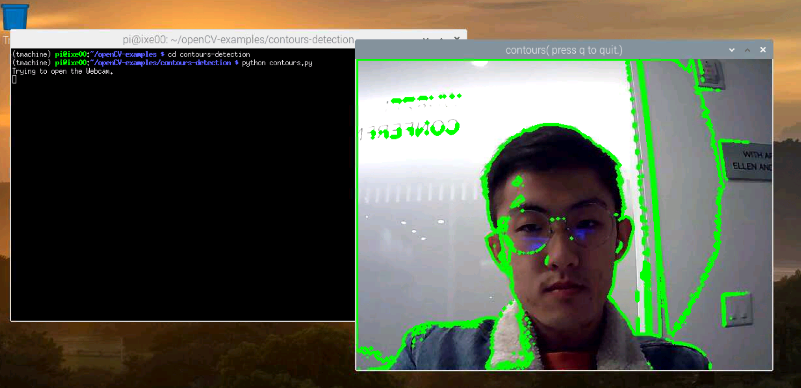
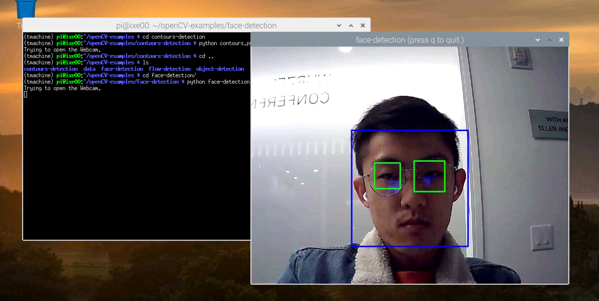
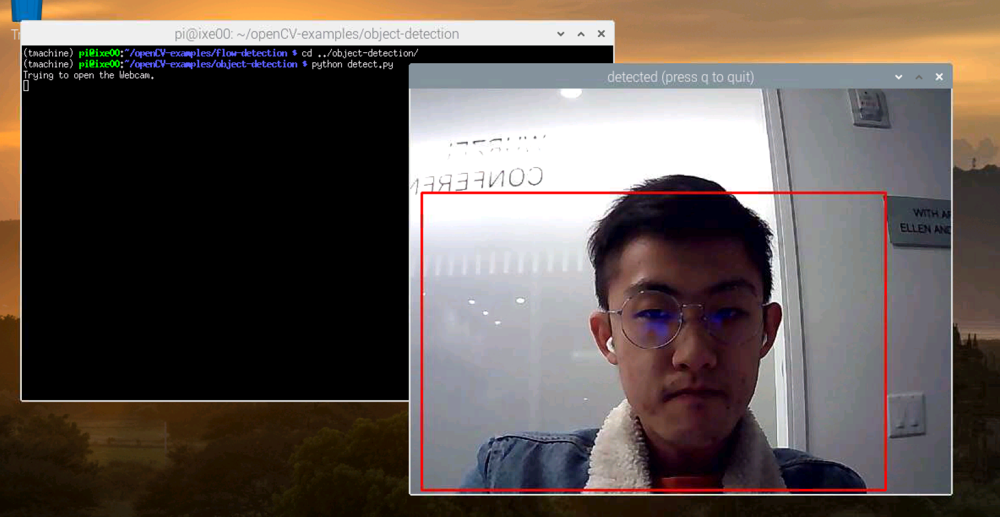
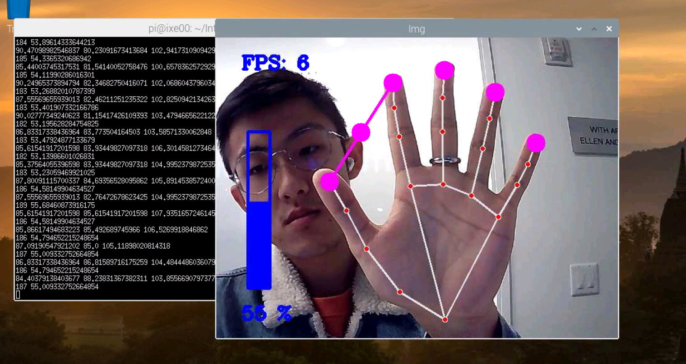
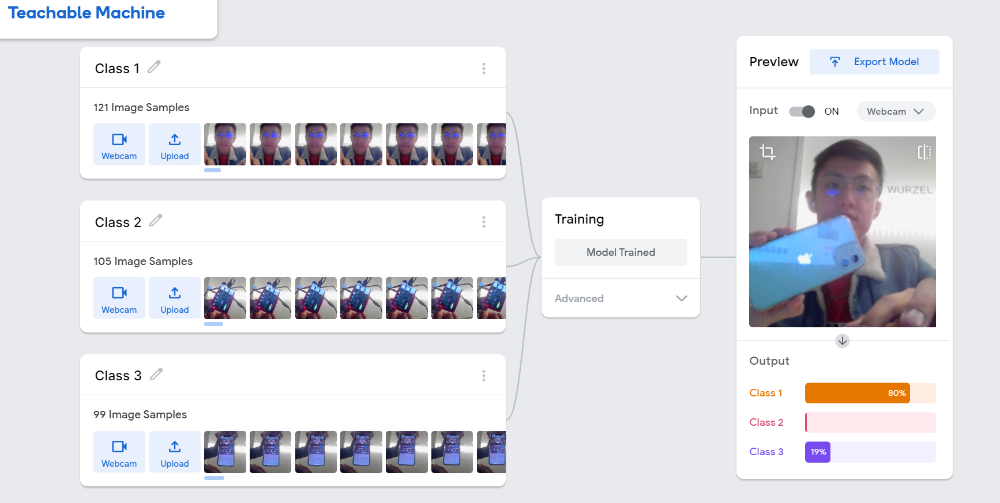

# Observant Systems


For lab this week, we focus on creating interactive systems that can detect and respond to events or stimuli in the environment of the Pi, like the Boat Detector we mentioned in lecture. 
Your **observant device** could, for example, count items, find objects, recognize an event or continuously monitor a room.

This lab will help you think through the design of observant systems, particularly corner cases that the algorithms needs to be aware of.

## Prep

1.  Pull the new Github Repo.
2.  Install VNC on your laptop if you have not yet done so. This lab will actually require you to run script on your Pi through VNC so that you can see the video stream. Please refer to the [prep for Lab 2](https://github.com/FAR-Lab/Interactive-Lab-Hub/blob/Fall2021/Lab%202/prep.md), we offered the instruction at the bottom.
3.  Read about [OpenCV](https://opencv.org/about/), [MediaPipe](https://mediapipe.dev/), and [TeachableMachines](https://teachablemachine.withgoogle.com/).
4.  Read Belloti, et al.'s [Making Sense of Sensing Systems: Five Questions for Designers and Researchers](https://www.cc.gatech.edu/~keith/pubs/chi2002-sensing.pdf).

### For the lab, you will need:

1. Raspberry Pi
1. Webcam 
1. Microphone (if you want to have speech or sound input for your design)

### Deliverables for this lab are:
1. Show pictures, videos of the "sense-making" algorithms you tried.
1. Show a video of how you embed one of these algorithms into your observant system.
1. Test, characterize your interactive device. Show faults in the detection and how the system handled it.

## Overview
Building upon the paper-airplane metaphor (we're understanding the material of machine learning for design), here are the four sections of the lab activity:

A) [Play](#part-a)

B) [Fold](#part-b)

C) [Flight test](#part-c)

D) [Reflect](#part-d)

---

### Part A
### Play with different sense-making algorithms.

#### OpenCV
A more traditional method to extract information out of images is provided with OpenCV. The RPI image provided to you comes with an optimized installation that can be accessed through python. We included 4 standard OpenCV examples: contour(blob) detection, face detection with the ``Haarcascade``, flow detection (a type of keypoint tracking), and standard object detection with the [Yolo](https://pjreddie.com/darknet/yolo/) darknet.

Most examples can be run with a screen (e.g. VNC or ssh -X or with an HDMI monitor), or with just the terminal. The examples are separated out into different folders. Each folder contains a ```HowToUse.md``` file, which explains how to run the python example. 

Following is a nicer way you can run and see the flow of the `openCV-examples` we have included in your Pi. Instead of `ls`, the command we will be using here is `tree`. [Tree](http://mama.indstate.edu/users/ice/tree/) is a recursive directory colored listing command that produces a depth indented listing of files. Install `tree` first and `cd` to the `openCV-examples` folder and run the command:

```shell
pi@ixe00:~ $ sudo apt install tree
...
pi@ixe00:~ $ cd openCV-examples
pi@ixe00:~/openCV-examples $ tree -l
.
├── contours-detection
│   ├── contours.py
│   └── HowToUse.md
├── data
│   ├── slow_traffic_small.mp4
│   └── test.jpg
├── face-detection
│   ├── face-detection.py
│   ├── faces_detected.jpg
│   ├── haarcascade_eye_tree_eyeglasses.xml
│   ├── haarcascade_eye.xml
│   ├── haarcascade_frontalface_alt.xml
│   ├── haarcascade_frontalface_default.xml
│   └── HowToUse.md
├── flow-detection
│   ├── flow.png
│   ├── HowToUse.md
│   └── optical_flow.py
└── object-detection
    ├── detected_out.jpg
    ├── detect.py
    ├── frozen_inference_graph.pb
    ├── HowToUse.md
    └── ssd_mobilenet_v2_coco_2018_03_29.pbtxt
```

The flow detection might seem random, but consider [this recent research](https://cseweb.ucsd.edu/~lriek/papers/taylor-icra-2021.pdf) that uses optical flow to determine busy-ness in hospital settings to facilitate robot navigation. Note the velocity parameter on page 3 and the mentions of optical flow.

Now, connect your webcam to your Pi and use **VNC to access to your Pi** and open the terminal. Use the following command lines to try each of the examples we provided:
(***it will not work if you use ssh from your laptop***)

```
pi@ixe00:~$ cd ~/openCV-examples/contours-detection
pi@ixe00:~/openCV-examples/contours-detection $ python contours.py
...
pi@ixe00:~$ cd ~/openCV-examples/face-detection
pi@ixe00:~/openCV-examples/face-detection $ python face-detection.py
...
pi@ixe00:~$ cd ~/openCV-examples/flow-detection
pi@ixe00:~/openCV-examples/flow-detection $ python optical_flow.py 0 window
...
pi@ixe00:~$ cd ~/openCV-examples/object-detection
pi@ixe00:~/openCV-examples/object-detection $ python detect.py
```

**\*\*\*Try each of the following four examples in the `openCV-examples`, include screenshots of your use and write about one design for each example that might work based on the individual benefits to each algorithm.\*\*\***

1. Contour screen shot 
    - This can be used as live-painting filter. The Contour indicates the major boundaries of the image, which can be detected as boundaries of block of colors. Users can select and change the color of the color blockchain as their will.
2. face detection screen shot 
    - By relative size and position of the entire head and eyes, this can be exploieted as detector of the direction of the user is facing. When it gets the direction of the user facing at, it can be used as a input of many games. 
3. Object detection screen shot 
    - It can detect how many users are there in front of the camera. For example, it can be used to detect how crowded the class is.
4. Optical flow screen shot 
    - It can keep track of the motion of the users' eyes, to detect if the user is paying attention to the screen or are being distracted. 

#### MediaPipe

A more recent open source and efficient method of extracting information from video streams comes out of Google's [MediaPipe](https://mediapipe.dev/), which offers state of the art face, face mesh, hand pose, and body pose detection.


To get started, create a new virtual environment with special indication this time:

```
pi@ixe00:~ $ virtualenv mpipe --system-site-packages
pi@ixe00:~ $ source mpipe/bin/activate
(mpipe) pi@ixe00:~ $ 
```

and install the following.

```
...
(mpipe) pi@ixe00:~ $ sudo apt install ffmpeg python3-opencv
(mpipe) pi@ixe00:~ $ sudo apt install libxcb-shm0 libcdio-paranoia-dev libsdl2-2.0-0 libxv1  libtheora0 libva-drm2 libva-x11-2 libvdpau1 libharfbuzz0b libbluray2 libatlas-base-dev libhdf5-103 libgtk-3-0 libdc1394-22 libopenexr23
(mpipe) pi@ixe00:~ $ pip3 install mediapipe-rpi4 pyalsaaudio
```

Each of the installs will take a while, please be patient. After successfully installing mediapipe, connect your webcam to your Pi and use **VNC to access to your Pi**, open the terminal, and go to Lab 5 folder and run the hand pose detection script we provide:
(***it will not work if you use ssh from your laptop***)


```
(mpipe) pi@ixe00:~ $ cd Interactive-Lab-Hub/Lab\ 5
(mpipe) pi@ixe00:~ Interactive-Lab-Hub/Lab 5 $ python hand_pose.py
```

Try the two main features of this script: 1) pinching for percentage control, and 2) "[Quiet Coyote](https://www.youtube.com/watch?v=qsKlNVpY7zg)" for instant percentage setting. Notice how this example uses hardcoded positions and relates those positions with a desired set of events, in `hand_pose.py` lines 48-53. 

**\*\*\*Consider how you might use this position based approach to create an interaction, and write how you might use it on either face, hand or body pose tracking.\*\*\***
- Screen shot of experimenting hand_post.py 
- It can detect different hand gesture, such as "I Love You", "Hive Five" or "Rock N Roll". This can be done by calculating the distance of tips of each finger, then setup conditions based on the coordinates of the fingers. 
- The percentage control can be used as the control of the font size displayed onto the screen. 

(You might also consider how this notion of percentage control with hand tracking might be used in some of the physical UI you may have experimented with in the last lab, for instance in controlling a servo or rotary encoder.)


#### Teachable Machines
Google's [TeachableMachines](https://teachablemachine.withgoogle.com/train) might look very simple. However, its simplicity is very useful for experimenting with the capabilities of this technology.


To get started, create and activate a new virtual environment for this exercise with special indication:

```
pi@ixe00:~ $ virtualenv tmachine --system-site-packages
pi@ixe00:~ $ source tmachine/bin/activate
(tmachine) pi@ixe00:~ $ 
```

After activating the virtual environment, install the requisite TensorFlow libraries by running the following lines:
```
(tmachine) pi@ixe00:~ $ cd Interactive-Lab-Hub/Lab\ 5
(tmachine) pi@ixe00:~ Interactive-Lab-Hub/Lab 5 $ sudo chmod +x ./teachable_machines.sh
(tmachine) pi@ixe00:~ Interactive-Lab-Hub/Lab 5 $ ./teachable_machines.sh
``` 

This might take a while to get fully installed. After installation, connect your webcam to your Pi and use **VNC to access to your Pi**, open the terminal, and go to Lab 5 folder and run the example script:
(***it will not work if you use ssh from your laptop***)

```
(tmachine) pi@ixe00:~ Interactive-Lab-Hub/Lab 5 $ python tm_ppe_detection.py
```


(**Optionally**: You can train your own model, too. First, visit [TeachableMachines](https://teachablemachine.withgoogle.com/train), select Image Project and Standard model. Second, use the webcam on your computer to train a model. For each class try to have over 50 samples, and consider adding a background class where you have nothing in view so the model is trained to know that this is the background. Then create classes based on what you want the model to classify. Lastly, preview and iterate, or export your model as a 'Tensorflow' model, and select 'Keras'. You will find an '.h5' file and a 'labels.txt' file. These are included in this labs 'teachable_machines' folder, to make the PPE model you used earlier. You can make your own folder or replace these to make your own classifier.)

**\*\*\*Whether you make your own model or not, include screenshots of your use of Teachable Machines, and write how you might use this to create your own classifier. Include what different affordances this method brings, compared to the OpenCV or MediaPipe options.\*\*\***

- Screen of teachable mechine 


*Don't forget to run ```deactivate``` to end the Teachable Machines demo, and to reactivate with ```source tmachine/bin/activate``` when you want to use it again.*


#### Filtering, FFTs, and Time Series data. (optional)
Additional filtering and analysis can be done on the sensors that were provided in the kit. For example, running a Fast Fourier Transform over the IMU data stream could create a simple activity classifier between walking, running, and standing.

Using the accelerometer, try the following:

**1. Set up threshold detection** Can you identify when a signal goes above certain fixed values?

**2. Set up averaging** Can you average your signal in N-sample blocks? N-sample running average?

**3. Set up peak detection** Can you identify when your signal reaches a peak and then goes down?

**\*\*\*Include links to your code here, and put the code for these in your repo--they will come in handy later.\*\*\***


### Part B
### Construct a simple interaction.

Pick one of the models you have tried, pick a class of objects, and experiment with prototyping an interaction.
This can be as simple as the boat detector earlier.
Try out different interaction outputs and inputs.

**\*\*\*Describe and detail the interaction, as well as your experimentation here.\*\*\***
- This is a mirror that is designed to encourage you and make your day better. Studies have shown that morivating gesture such as high-five or thumb-up would be interpreted by human brain as a sign of recognizing and friendlyness, so this machine intends to motivate you to make the gesture, alone with the motivating quotes, to motivate the user's day. 
- When you show your gesture, such as "high five" and "thumb up", the display will show corresponding texts, as long as with some random motivating quotes.  

### Part C
### Test the interaction prototype

Now flight test your interactive prototype and **note down your observations**:
For example:
1. When does it what it is supposed to do?
    - It should be activated when the user shows their hand to the camera, and the mirror (the raspberry pi with camera) will detect the gesture and display texts accordingly.
1. When does it fail?
    - It would fail if the user makes a gesture that is ambiguous between the known gestures such as high-five, thumb-up and quite-coyote.
2. When it fails, why does it fail?
    - Since there are ambibuity between gesture. 
3. Based on the behavior you have seen, what other scenarios could cause problems?
    - Since the condition of gesture is determined by the distance between tips of fingers, it is necessary for the user to place their hand close enough to the camera, or the detection functionality would fail.

**\*\*\*Think about someone using the system. Describe how you think this will work.\*\*\***
1. Are they aware of the uncertainties in the system?
    - The uncertainty is that the user needs to place their gesture near the camera enough, so that their hand can be detected by openCV.
2. How bad would they be impacted by a miss classification?
    - It would not be terrible when the machine misclassifying the gesture. The only potential danger is the emotion of the user might be affected by the motivating quote.
3. How could change your interactive system to address this?
   - If there are uncertanties, the system will prompt the user to make the gesture more explicit, or ask the user to move close to the camera. 
4. Are there optimizations you can try to do on your sense-making algorithm.
    - Yes. The detection algorithm can be optimized by machine learning. Instead of using distance of finger tips, a machine learning algorithm is able to detect the gesture in different angle with much higher accuracy, since it is not rely on the position of the pixels. 

### Part D
### Characterize your own Observant system

Now that you have experimented with one or more of these sense-making systems **characterize their behavior**.
During the lecture, we mentioned questions to help characterize a material:
* What can you use X for?
* What is a good environment for X?
* What is a bad environment for X?
* When will X break?
* When it breaks how will X break?
* What are other properties/behaviors of X?
* How does X feel?

**\*\*\*Include a short video demonstrating the answers to these questions.\*\*\***

### Link to video in which the system fails
#### [video](https://youtu.be/qQaK5ORXFtI)
* What can you use X for?
  - For self motivating purposes; to cheer yourself up.
* What is a good environment for X?
  - A room with sufficitn light, and some room for you to stand in front of the mirror. 
* What is a bad environment for X?
  - As the video demonstrated, if the camera does not receive enough lightening, the openCV hand detection function will not work as good as expected. 
* When will X break?
  - When the user places their hands too close the the camera, for instance when part of their hands are outside of the scope of the camera, then the openCV library might fail to detect the shape of the hands, which would frustrate the users. 
* When it breaks how will X break?
  - When it breaks, the camera and mirror (the display) can still work properly. The system doesn't shutdown due to certain user behavior. It is only activated when it detects a recognizable gesture.
* What are other properties/behaviors of X?
  - When the user shows their hand but not make a recognizable gesture, the system will display "hello" to the user and prompt them to make some gesture.
* How does X feel?
  - It feels like a decent mirror, but the functionality can still be broden. 


### Part 2.

Following exploration and reflection from Part 1, finish building your interactive system, and demonstrate it in use with a video.

**\*\*\*Include a short video demonstrating the finished result.\*\*\***

### [link to video](https://www.youtube.com/watch?v=9FdLN01lGtw)
### [link to video - version 2](https://youtu.be/txl9n3r0igo)

### Improvements in part s
- Instead of one quote to one gesture, I randomized the quote so that each time the user changes the gesture, there will be a different quote displaying. 
- I optimized the parameters of gesture detection, so that the "coyote" and "I love you" sign can be distinguished more precisely.
- Also I added a new feature - the mirror, which is the popup screen in VNC viewer from raspberry pi, will display "hello" when the system is not actively detecting a hand, to make the mirror more interactive.
