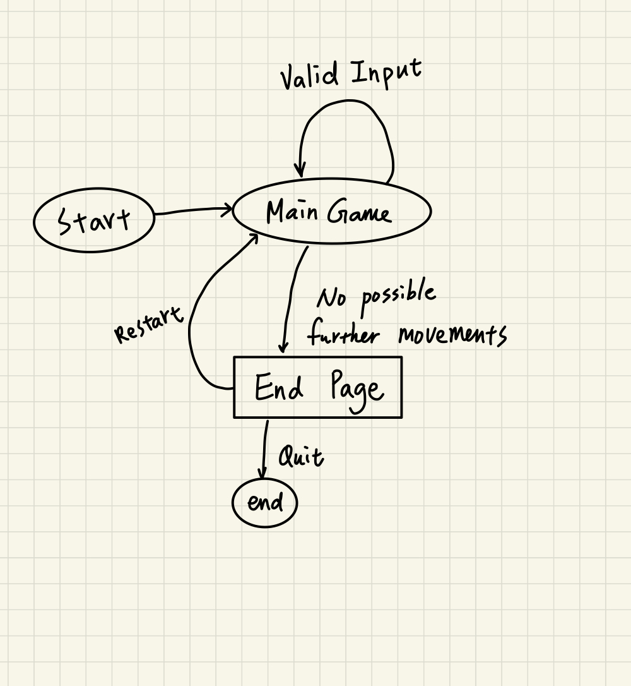

# 2048 Game


# Introduction
This is the classic 2048 game, which is initially developed by Gabriele Cirulli. The objective of the game is to slide and combine the same tiles to reach 2048, but players can continue to play after reaching the goal. 

Originally the player can play only with the arrow keys, now the game has been augmented so that the player can play with multiple control input: joystick, vim-movement, touch sensor, even with their hand with camera!

I implemented the game engine in [my game engine project](https://github.com/ethanh6/Adversarial_Search_2048_Game) using Pygame and OpenCV. Now the player can play the game with different sensors which is connected to the Raspberry Pi server, and since the raspberry pi is connected headlessly, the main game screen will be forwarded to my laptop using X11 forwarding. 

# What you will need

1. Raspberry Pi

2. Capacity Sensor

3. SparkFun Qwiic Joystick

4. Webcam

5. Banana connector

6. MiniPi TFT display

7. Laptop

8. Internet connection


# Setup X11 forwarding 

1. [download](https://sourceforge.net/projects/xming/) and open XMing as X11 display server.

2. In Putty
	- make sure the laptop and the Raspberry Pi is under the same network. 
	- configuration -> connection -> SSH -> X11 -> check "enable X11 forwarding"
	- type in the IP of the Raspberry Pi, and start the SSH connection

# Setup the physical machine

1. Connect camera to Raspberry Pi

2. Streamline the capacity sensor and the joystick

3. Connect the banana connector to the capacity sensor 0 to 5.


# Setup the project
```
$ pi@ixe00: git clone https://github.com/ethanh6/Interactive-Lab-Hub.git
$ pi@ixe00: virtualenv 2048
$ pi@ixe00: source 2048/bin/activate
$ (2048) pi@ixe00: cd Interactive-Lab-Hub/final_project/2048/
$ (2048) pi@ixe00~/Interactive-Lab-Hub/final_project/2048: pip3 install -r requirements.txt
```

# To run the game
```
$ (2048) pi@ixe00~/Interactive-Lab-Hub/final_project/2048: python main.py
```

> You should be able to see a main game window camera windows pop up.


# How to play the game

## Rule
Move the tile to merge the same numbers, you win if reach 2048, and you can still play to reach higher score than that.

The game will end if there is no further movements you can perform.

## Keyboard
- Arrow keys
- VIM movements (h: LEFT, j: DOWN, k: UP, l: RIGHT)
- `r` to restart the game.
- `u` to undo a movement.
- `3 ~ 7` to adjust board size, default board size=4 (e.g. `3` will change to 3x3 board).
- `e` to jump to game over page.
- `ESC` or `q` to quit the game.

## Joystick
- Move the joystick to move the tile.
- push button to undo movement

## Gesture 
- Use your finger to point to the direction you want to move the tile (up, down left, right).
- Note: the FPS depends on the internet speed - if the internet connection is slow, then the gesture control might not be as sensitive as expected. 


> As you can see in the picture, the camera detects the "right" gesture, and the movement log in the terminal correctly show that this is gesture to the direction "right".

## Capacity sensor
1. There are 6 options you can do on it, which is labeled on the machine.
2. Connection on the capacity sensor: 
	- 0: up
	- 1: down
	- 2: left
	- 3: right
	- 4: undo
	- 5: end game 

# Application Architecture


# State Diagram



# Documentation

## Timeline

- 11/22: *Project plan proposal*
- 11/25: finish game engine
- 11/28: simple I/O done - control the game with joystick and capacity sensor
- 12/2 : *functional check-off*
- 12/4 : implement openCV gesture recognizer - control with hand
- 12/10 : implement extra features - switch theme with gesture
- 12/6 : *project demo*
- 12/7 : tried implement voice recognizer - control with voice
- 12/13: *final project due*

## Structure of the repo
```
Interactive-Lab-Hub
└───Lab 1
└───Lab 2
└───Lab 3
└───Lab 4
└───Lab 5
└───Lab 6
└───final_project
│   └───Pacman                        -> (archive of pacman)
│   └───2048                          -> main project repo
│       |   main.py                   -> main game engine
│       |   README.md                 -> this readme
│       |   HandTrackingModule.py     -> gesture detection
│       |   requirements.txt          -> to install package
│       └───imgs                      -> images for the readme
│       └───speech                    -> (archive for speech module)
```

## Design

This project is inspired by the project demo at the start of the semester, where a previous student's project enables player to play Flappy-Bird with their head movements. The main idea of this project is to design a similar control input on different game. 

At first I want to design a Pacman game with similar controls. However, when I tried to implemented the game, I realized that there is a technical difficulty that is, Pacman heavily relies on real-time movement and the movements are required to be detected instantly, which is not feasible while using the OpenCV on raspberry pi, which has only limited computational power. 

Instead, I turned to another game that does not require instant movement detection - 2048, with the same inputs that are used to be in Pacman. 

As for the game engine, I re-used the 2048 game that I implemented in a previous course, with augmentations that accept extra input such as joystick and capacity sensor. 

The first obstable that I encourtered is how to foward the raspberry pi display, from pygame, to my laptop using SSH. Initially, I connected a monitor to the Pi to develop the game, but obviously headless mode is the optimal way to demo the project and develop on my laptop. It actually took me two days to finalized the X11 forwarding settings since I was not familiar with this technologies. This is the main reason why the machine does not work in the day of project demo, but the problem has been fixed.

When I implemented the gesture detection feature, I realized that the low FPS would be problematic and affect the player's experience. To optimize the gesture detection module that we used in previous lab, I removed redundant parts and only kept the index finger and thumb since those is all I need to detect a direction. This optimization method slightly improved the FPS from 0.1 to 2, however, it still depends on the speed of the internet connection.

The next problem I faced is to implement voice control feature. In the ideal situation, the player can say, for example, "right" or "up". to move the tile. However, the Vosk module did not work as expected - it's able to detect numbers, but it doesn't recognize words like "left" and "down". It took me another two days to try implementing this feature, but I eventually removed it not only because the problem described, but also that combining voice recognition and gesture detection might even drain the performance of Pi. 

## Change of Design

1. Game engine: Pacman -> 2048
2. Remove voice control option

## Improvement could be done in the future

1. Minimize the OpenCV module to improve FPS
2. Optimize voice control
3. Add other sensor such as approximity sensor or GyroScope sensor.

# Demo Video

[Video Link](https://youtu.be/BrQ0-jL41yk)

Player credit: Kristjan Tomasson

# Team

Ethan Huang (eh543)